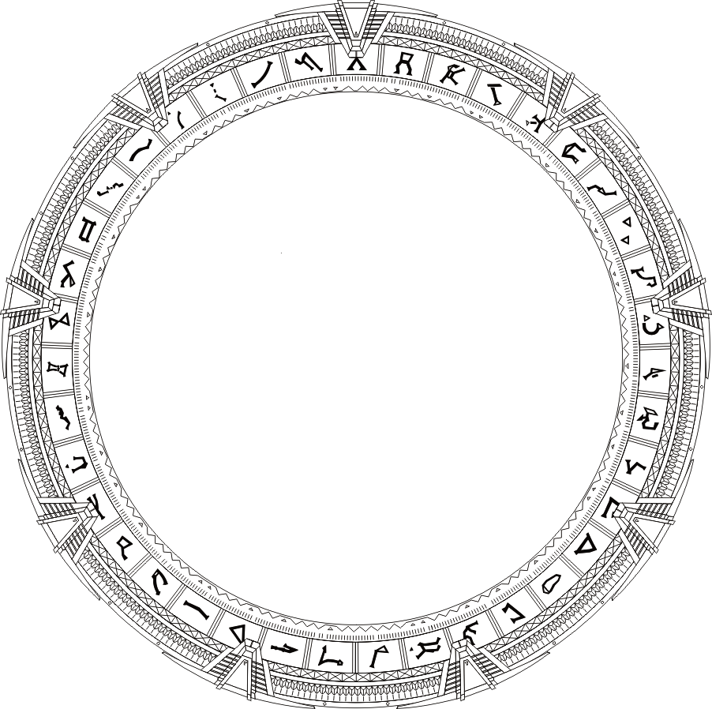

# Gate Addresses

Some of this may differ slightly from the television shows or other canonical sources to create greater consistency for the campaign. We shall describe gate addresses in the form of `ABCDEFZ`, where `ABCDEF` (or alternately `AB CD EF`) represents the destination portion and `Z` represents the point of origin.

**Given:**

* A stargate has 39 symbols on it: 38 common to all gates and one that is unique representing that specific gate
* A gate address consists of seven symbols
* The first six symbols represent the destination
* The seventh symbol represents the point of origin, where one is dialing from, which is always the unique symbol for that gate (even though this rule is not held to in the television show &mdash; see below)
* Each symbol represents a fixed point in space
* The destination is described as three intersecting lines in space
* Each line is described by two symbols
* `AB` and `BA` describe the same line
* `AB CD EF` and `CD AB EF` describe the same intersection point
* `AB CD EF` and `AC BD EF` describe different intersection points
* All symbols in a gate address must be unique (because no matter where in a gate address a symbol is duplicated, the only possible intersection point is that duplicated symbol)

**Therefore:**

* A gate address consists of three pairs of symbols where:
    * The order of the symbols does not matter within each pair
    * The order of the pairs does not matter
* A gate address consists of three combinations without repetition: `38C2` (703 combinations), `36C2` (630 combinations), `34C2` (561 combinations)
    * The first pair is "38 choose 2" combinations but because those two symbols have been "used" in the gate address, the second pair is "36 choose 2", and finally "34 choose 2" for the final pair
* There are 703 \* 630 \* 561 or 248,461,290 possible gate addresses

## Duplicate symbols in a gate address

Despite the fact that [all gate addresses seen in the show](http://www.rdanderson.com/stargate/glyphs/index.htm) did not show any duplicate symbols:

* A line can only be described by two _different_ symbols
    * If the symbols were the same, this means that the only possible intersection point for all three lines would be that single point in space. In other words, the only possible intersection point for any address containing the pair `AA` would be at `A`.
* Two lines cannot share a symbol between them
    * If two lines shared a symbol, the only possible intersection point for any address containing `AB` and `AC` would be at `A`.
* Any address containing two `A` symbols anywhere in the address is effectively the same address as `AAAAAAZ`
* **Therefore:** all symbols in a gate address must be unique

Interestingly, the TV show has a couple instances where the point of origin used is one of the symbols that is common to all gates and **not** a symbol that is unique to that one gate. If the point of origin is the point in space of one of the gate symbols `S`, then that gate's address would be `SSSSSSZ` or an equivalent. (But why bother memorizing six symbols when you only have to remember one?)

If we choose to allow for gates at reference points like this, then that only adds 38 gate addresses to our list of possible combinations above. Therefore, the number of possible gate addresses is 703 \* 630 \* 561 + 38 or 248,461,328 possible gate addresses.
